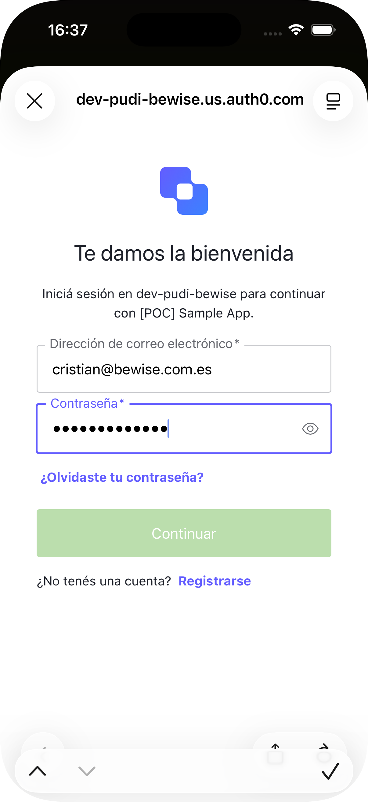
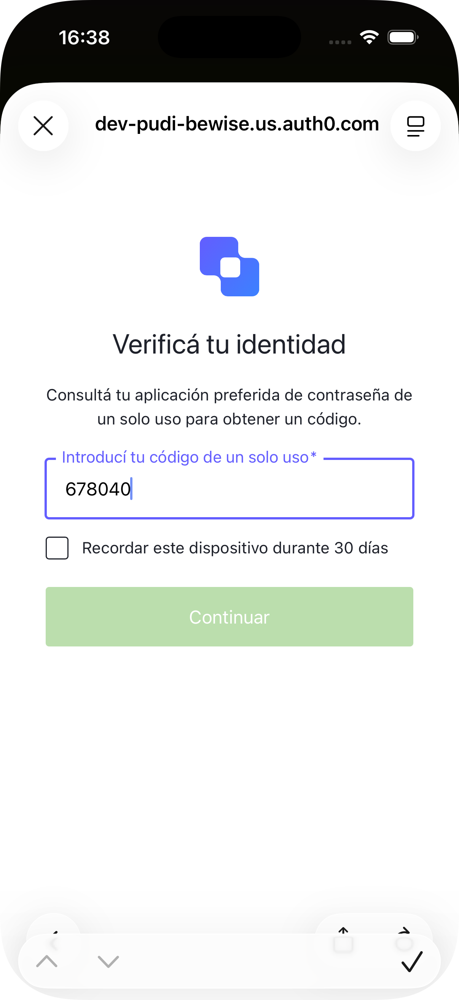
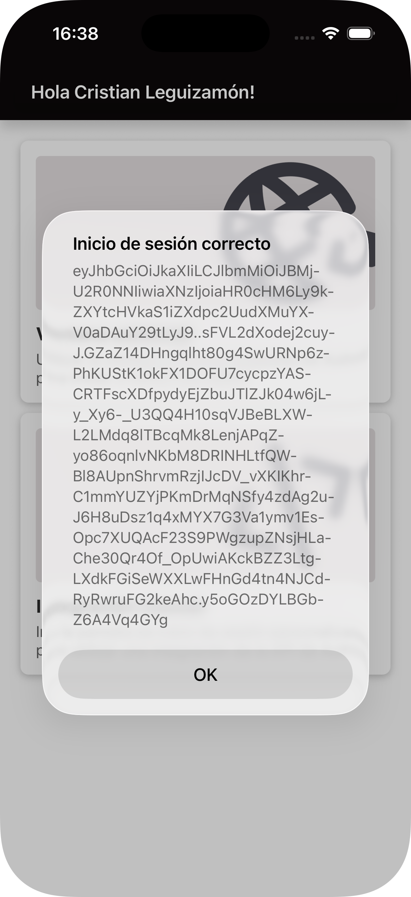
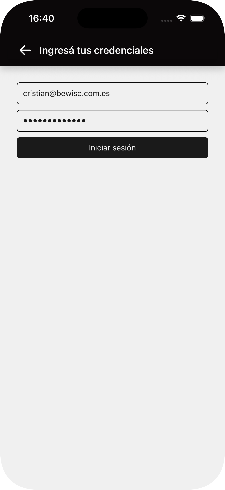
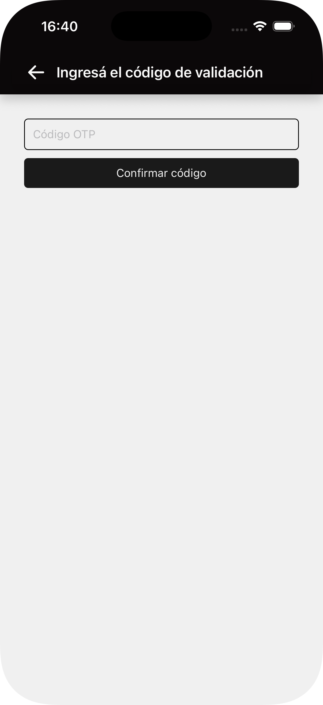
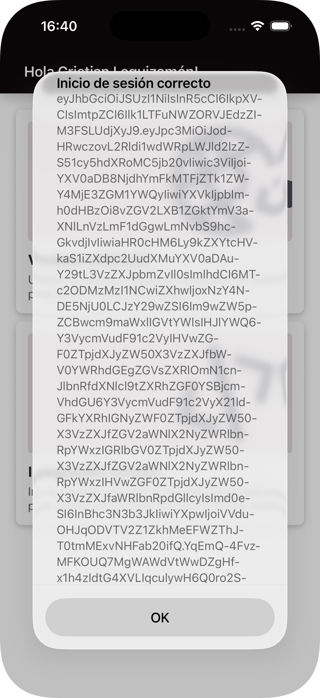
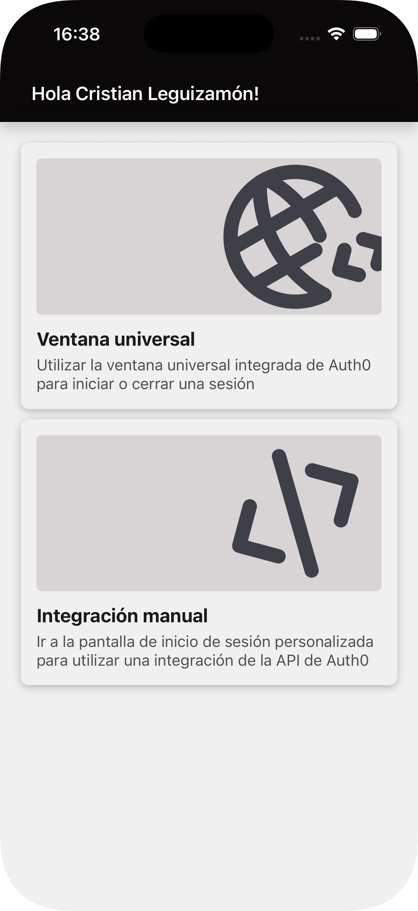
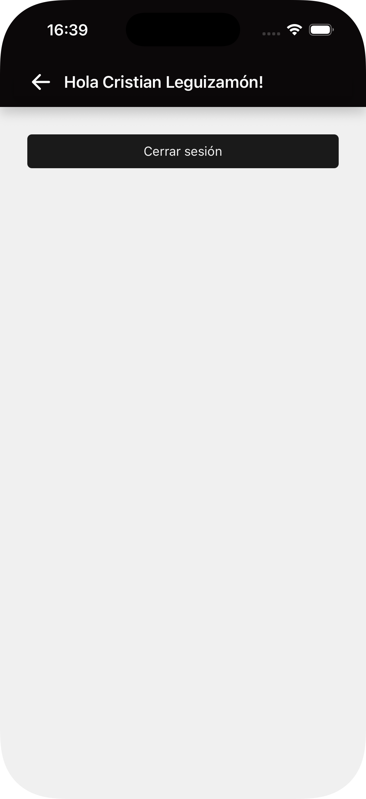

# Auth0POC

This is a POC app made in React Native for login with OTP using the Auth0 API.

## Features

There are two methods for login:
1.  **Integrated Auth0 Webapp**: Uses the standard Auth0 web authentication flow.
2.  **Manual Method**: Uses a custom form inside the application to interact with the Auth0 API directly.

## UI Flow & Screenshots

The application follows a specific flow depending on the chosen login method.

### Default Screen
The entry point of the application.\
<br />


### Option 1: Auth0 Integrated Login
If the user selects the standard Auth0 login:

1.  **Login Screen**
<br />

    
2.  **OTP Verification**
<br />


3.  **Logged In State**
<br />


### Option 2: Manual Login
If the user selects the manual custom form login:

1.  **Manual Login Screen**
<br />


2.  **OTP Verification**
<br />


3.  **Logged In State**
<br />


### Authenticated State
Once logged in via either method:

*   **Home (Logged)**: Shows the home screen with the logged-in user's name.
<br />


### Logout
*   **Logout Screen**: This is the same screen as the Manual Login, but reflects the state if the user is already logged in (or handles the logout process).
<br />


---

# Getting Started

> **Note**: Make sure you have completed the [Set Up Your Environment](https://reactnative.dev/docs/set-up-your-environment) guide before proceeding.

## Environment setup (local development)

Create a `.env` file at the project root with your Auth0 settings:

```env
AUTH0_CLIENT_ID=your_client_id
AUTH0_CLIENT_SECRET=your_client_secret
AUTH0_DOMAIN=your-tenant.us.auth0.com
AUTH0_AUDIENCE=https://your-tenant.us.auth0.com/api/v2/
```


Never commit real secrets to source control.

## Step 1: Start Metro

First, you will need to run **Metro**, the JavaScript build tool for React Native.

To start the Metro dev server, run the following command from the root of your React Native project:

```sh
# Using npm
npm start

# OR using Yarn
yarn start
```

## Step 2: Build and run your app

With Metro running, open a new terminal window/pane from the root of your React Native project, and use one of the following commands to build and run your Android or iOS app:

### Android

```sh
# Using npm
npm run android

# OR using Yarn
yarn android
```

### iOS

For iOS, remember to install CocoaPods dependencies (this only needs to be run on first clone or after updating native deps).

```sh
pod cache clean --all
pod install
```

```sh
# Using npm
npm run ios

# OR using Yarn
yarn ios
```
